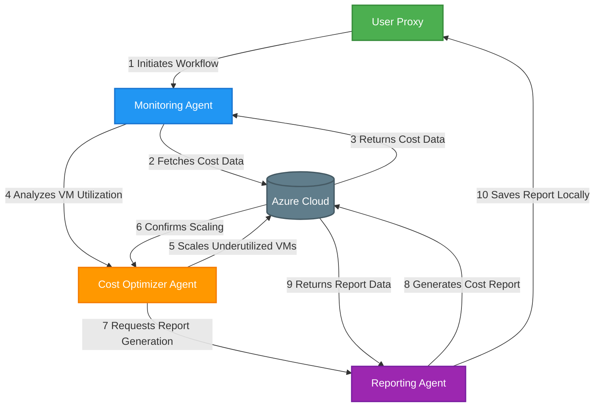

# Azure Cost Optimization Agent System

## Overview
This project is an automated system for monitoring Azure costs, identifying underutilized resources, and optimizing cloud spending using AI agents. It leverages various Python libraries and Azure APIs to collect cost data, analyze VM utilization, scale down underutilized resources, and generate detailed cost reports.

## Features
- **Azure Cost Data Collection**: Fetches cost data from Azure Consumption API.
- **VM Utilization Analysis**: Analyzes CPU usage and uptime to identify underutilized VMs.
- **Automated Scaling**: Safely scales down underutilized VMs to optimize costs.
- **Cost Reporting**: Generates detailed CSV reports for cost analysis.
- **Multi-Agent Collaboration**: Uses Microsoft AutoGen for agent-based automation.

## System Design


## Components
### Data Collection
- **Azure Consumption API Integration**: Fetches cost and usage data.
- **VM Metrics Collection**: Collects CPU usage and uptime metrics.

### Analysis Engine
- **Utilization Threshold Checks**: Identifies VMs with CPU usage below 10%.
- **Resource Eligibility Verification**: Ensures VMs meet scaling criteria (e.g., uptime ≥ 7 days).

### Action System
- **Safe Scaling Operations**: Deallocates underutilized VMs.
- **Validation Checks**: Validates VM IDs and permissions before scaling.
- **Error Handling**: Captures and logs errors during scaling operations.

### Reporting
- **CSV Report Generation**: Creates detailed cost reports.
- **Historical Data Tracking**: Tracks cost data over time.

### Agent Framework
- **Monitoring Agent**: Collects and analyzes cost data.
- **Cost Optimizer**: Manages resource scaling.
- **Reporting Agent**: Generates and saves reports.

## Installation
### Prerequisites
- Python 3.8+
- Azure service principal with:
  - **Cost Management Reader** role
  - **Virtual Machine Contributor** role
  - **Monitoring Reader** role
- **Groq API Key** for using the Groq API for AI agent interactions.
- **Azure Subscription ID, Tenant ID, Client ID, and Client Secret.**

### Steps
1. Clone the repository:
   ```bash
   git clone https://github.com/yourusername/azure-cost-optimizer.git
   cd azure-cost-optimizer
   ```
2. Install dependencies:
   ```bash
   pip install -r requirements.txt
   ```
3. Set up environment variables:
   - Copy `.env.example` to `.env` and fill in the required Azure credentials and Groq API key.

4. Run the optimizer:
   ```bash
   python -m azure_cost_optimizer.optimizer
   ```

## Project Structure
```
Azure Cost Optimization Agent System/
├── azure_cost_optimizer/
│   ├── __init__.py
│   └── optimizer.py  # Main code file
├── config/
│   └── agent_config.json  # AutoGen configuration
├── reports/  # Generated reports
├── .env.example  # Environment template
├── .gitignore
├── README.md
├── requirements.txt
└── setup.py  # Optional for package installation
```

## Dependencies
- `os`: For environment variables and file operations.
- `requests`: HTTP requests to Azure APIs.
- `pandas`: Data manipulation and CSV report generation.
- `paramiko`: SSH into VMs to check CPU usage.
- `dotenv`: Load environment variables from `.env`.
- `azure.identity`: Authenticate with Azure using client credentials.
- `autogen`: Framework for creating AI agents that automate tasks.
- `datetime`: Handle dates for filtering cost data.
- `shutil`: File operations for saving reports.
- `groq`: For interacting with the Groq API for AI agent interactions.

## Main Steps in the Code
1. Load environment variables for Azure credentials and Groq API key.
2. Authenticate with Azure.
3. Fetch Azure cost data via API.
4. Check VM CPU usage using SSH or Azure metrics.
5. Analyze VM utilization to find underutilized instances.
6. Scale down identified VMs.
7. Generate cost reports using `pandas`.
8. Use AutoGen agents to automate the monitoring, scaling, and reporting process.

## Agentic AI Pattern
### Pattern Used: Multi-Agent Collaboration
This project employs a multi-agent collaboration pattern using Microsoft AutoGen. The system is divided into three specialized agents:

- **Monitoring Agent**: Responsible for collecting and analyzing cost data.
- **Cost Optimizer Agent**: Manages the scaling of underutilized resources.
- **Reporting Agent**: Generates and saves cost reports.

### Benefits of Using Multi-Agent Collaboration
- **Specialization**: Each agent is specialized in a specific task, leading to more efficient and accurate operations.
- **Scalability**: The system can easily be extended by adding more agents for additional tasks.
- **Fault Tolerance**: If one agent fails, the others can continue to operate, ensuring system resilience.
- **Automation**: The agents can work autonomously, reducing the need for manual intervention.

## Tutorials
- [Azure Cost Management API Documentation](https://learn.microsoft.com/en-us/azure/cost-management-billing/cost-management-data-api-overview)
- [Microsoft AutoGen Framework](https://microsoft.github.io/autogen/)
- [Working with Azure Identity SDK](https://learn.microsoft.com/en-us/python/api/overview/azure/identity)
- [Groq API Documentation](https://groq.com/docs)

## Contributing
Contributions are welcome! Please open an issue or submit a pull request for any improvements or bug fixes.

## License
This project is free for personal and educational use. Commercial use, modification, and redistribution require prior approval.

## Contact
For questions or feedback, please reach out to [RAHUL.NSEC.C@GMAIL.COM](mailto:RAHUL.NSEC.C@GMAIL.COM).