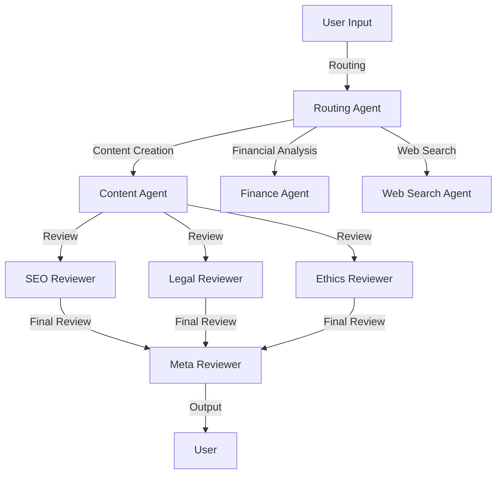

# AI Agent Collaboration Hub

## Overview
This project is an advanced AI agent collaboration system designed to handle various tasks such as content creation, financial analysis, web search, and more. It leverages multiple AI models and tools, including Groq, OpenAI, and YFinance, to provide context-aware and intelligent responses. The system uses a multi-agent architecture to route tasks to specialized agents, ensuring efficient and accurate task execution.

## Features
- **Multi-Agent Collaboration:** Utilizes specialized agents for content creation, financial analysis, web search, and more.
- **Context-Aware Routing:** Routes user queries to the most appropriate agent based on context and content.
- **Real-Time Data Integration:** Integrates real-time financial data and web search results.
- **Content Review System:** Includes SEO, legal, and ethical review systems to ensure high-quality content.
- **Database Integration:** Stores chat history and context in a SQLite database for continuity and analysis.

## System Design


## Components
### Agents
- **Routing Agent:** Determines the most appropriate agent to handle the user's query.
- **Content Agent:** Handles content creation and editing tasks.
- **Finance Agent:** Provides financial analysis and stock market data.
- **Web Search Agent:** Performs web searches and retrieves relevant information.
- **SEO Reviewer:** Reviews content for SEO optimization.
- **Legal Reviewer:** Ensures content complies with legal standards.
- **Ethics Reviewer:** Reviews content for ethical considerations.
- **Meta Reviewer:** Aggregates feedback from all reviewers and provides final suggestions.

### Tools and Models
- **Groq:** Used for high-performance AI model inference.
- **OpenAI:** Provides advanced natural language processing capabilities.
- **YFinance:** Fetches real-time financial data.
- **DuckDuckGo:** Performs web searches.

### Database
- **SQLite:** Stores chat history and context for continuity and analysis.

## Installation
### Prerequisites
- Python 3.8+
- Groq API Key
- OpenAI API Key
- YFinance and DuckDuckGo integrations

### Steps
1. Clone the repository:
   ```bash
   git clone https://github.com/yourusername/ai-agent-collaboration-hub.git
   cd ai-agent-collaboration-hub
   ```
2. Install dependencies:
   ```bash
   pip install -r requirements.txt
   ```
3. Set up environment variables:
   - Copy `.env.example` to `.env` and fill in the required API keys.
4. Run the system:
   ```bash
   python -m ai_agent_collaboration_hub.main
   ```

## Project Structure
```
AI Agent Collaboration Hub/
├── ai_agent_collaboration_hub/
│   ├── __init__.py
│   └── main.py  # Main code file
├── config/
│   └── agent_config.json  # AutoGen configuration
├── logs/  # Log files
├── .env.example  # Environment template
├── .gitignore
├── README.md
├── requirements.txt
└── setup.py  # Optional for package installation
```

## Dependencies
- `os`: For environment variables and file operations.
- `logging`: For logging system activities.
- `re`: For regular expressions.
- `traceback`: For error tracing.
- `phi`: For AI agent framework.
- `groq`: For Groq model integration.
- `yfinance`: For financial data.
- `duckduckgo`: For web search.
- `openai`: For OpenAI model integration.
- `gradio`: For user interface.
- `autogen`: For multi-agent collaboration.
- `sqlalchemy`: For database operations.
- `dotenv`: For loading environment variables.

## Tutorials
- [Groq API Documentation](https://groq.com/docs)
- [OpenAI API Documentation](https://openai.com/docs)
- [YFinance Documentation](https://pypi.org/project/yfinance/)
- [DuckDuckGo Search API](https://duckduckgo.com/api)
- [Microsoft AutoGen Framework](https://github.com/microsoft/autogen)

## Contributing
Contributions are welcome! Please open an issue or submit a pull request for any improvements or bug fixes.

## License
This project is free for personal and educational use. Commercial use, modification, and redistribution require prior approval.

## Contact
For questions or feedback, please reach out to `RAHUL.NSEC.C@GMAIL.COM`. 
