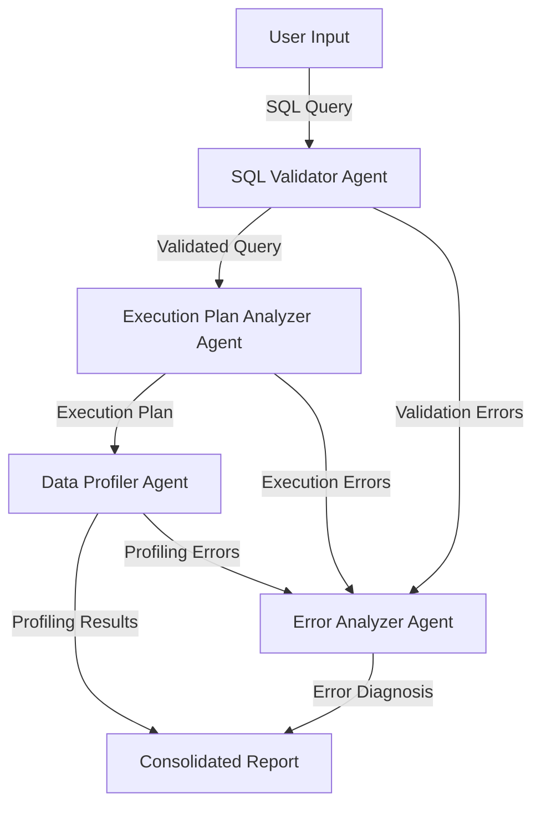

# SQL Query Analyzer System

## Overview
This project is an AI-powered SQL query analysis system that leverages multiple specialized agents to validate, optimize, and profile SQL queries. It uses the ReAct framework for structured reasoning and action planning, combined with Streamlit for a user-friendly interface. The system is designed to help database administrators and developers improve query performance and ensure data quality.

## Features
- **SQL Query Validation**: Validates SQL syntax and identifies potential issues.
- **Execution Plan Analysis**: Analyzes query execution plans to identify performance bottlenecks.
- **Data Profiling**: Profiles query results to assess data quality and characteristics.
- **Error Analysis**: Diagnoses and provides solutions for SQL errors.
- **Multi-Agent Collaboration**: Uses specialized AI agents for different analysis tasks.
- **Interactive Interface**: Provides a user-friendly web interface using Streamlit.

## System Design


## Components
### SQL Validator Agent
- **Role**: Validates SQL syntax and identifies potential issues.
- **Tools**: `validate_sql(query)`
- **Output**: Validation report with recommendations.

### Execution Plan Analyzer Agent
- **Role**: Analyzes query execution plans to identify performance bottlenecks.
- **Tools**: `get_execution_plan(query)`
- **Output**: Performance analysis report with optimization suggestions.

### Data Profiler Agent
- **Role**: Profiles query results to assess data quality and characteristics.
- **Tools**: `profile_query_results(query)`
- **Output**: Data quality report with statistics and samples.

### Error Analyzer Agent
- **Role**: Diagnoses SQL errors and provides solutions.
- **Tools**: `analyze_error(error, query)`
- **Output**: Error analysis report with recommendations.

## User Interface
- **Framework**: Streamlit
- **Features**:
  - Input area for SQL queries.
  - Interactive analysis reports.
  - Error handling and display.

## Installation
### Prerequisites
- Python 3.8+
- MySQL database access with:
  - **DB_HOST**: Database host
  - **DB_USER**: Database user
  - **DB_PASSWORD**: Database password
  - **DB_NAME**: Database name
- Groq API Key for AI agent interactions.

### Steps
1. Clone the repository:
   ```bash
   git clone https://github.com/yourusername/sql-analyzer.git
   cd sql-analyzer
   ```
2. Install dependencies:
   ```bash
   pip install -r requirements.txt
   ```
3. Set up environment variables:
   - Copy `.env.example` to `.env` and fill in the required database credentials and Groq API key.

4. Run the application:
   ```bash
   streamlit run sql_analyzer.py
   ```

## Project Structure
```
SQL Query Analyzer System/
├── sql_analyzer.py  # Main application file
├── .env.example  # Environment template
├── .gitignore
├── README.md
├── requirements.txt
└── sql_debugging.log  # Log file for debugging
```

## Dependencies
- `streamlit`: For the web interface.
- `mysql-connector-python`: For database connectivity.
- `pandas`: For data manipulation and profiling.
- `autogen`: Framework for creating AI agents.
- `dotenv`: For loading environment variables.
- `logging`: For logging and debugging.

## Main Steps in the Code
1. **Initialize Agents**: Set up specialized agents for validation, execution plan analysis, data profiling, and error analysis.
2. **Register Tools**: Register database operations as tools for the agents.
3. **Analyze Query**: Perform a comprehensive analysis of the SQL query using the ReAct framework.
4. **Handle Errors**: Diagnose and provide solutions for any errors encountered during analysis.
5. **Generate Reports**: Consolidate and present analysis reports in the Streamlit interface.

## Agentic AI Pattern
- **Pattern Used**: ReAct Framework
- **Benefits of Using ReAct Framework**:
  - **Structured Reasoning**: Ensures a systematic approach to problem-solving.
  - **Action-Oriented**: Agents can take specific actions (e.g., validating SQL, profiling data) based on their reasoning.
  - **Transparency**: The thought-action-observation cycle provides clear insights into the decision-making process.
  - **Flexibility**: Easily extendable to include additional analysis steps or agents.

## Tutorials
- [Streamlit Documentation](https://docs.streamlit.io/)
- [MySQL Connector/Python Documentation](https://dev.mysql.com/doc/connector-python/en/)
- [Microsoft AutoGen Framework](https://microsoft.github.io/autogen/)
- [Groq API Documentation](https://groq.com/docs)

## Contributing
Contributions are welcome! Please open an issue or submit a pull request for any improvements or bug fixes.

## License
This project is free for personal and educational use. Commercial use, modification, and redistribution require prior approval.

## Contact
For questions or feedback, please reach out to [RAHUL.NSEC.C@GMAIL.COM](mailto:RAHUL.NSEC.C@GMAIL.COM).